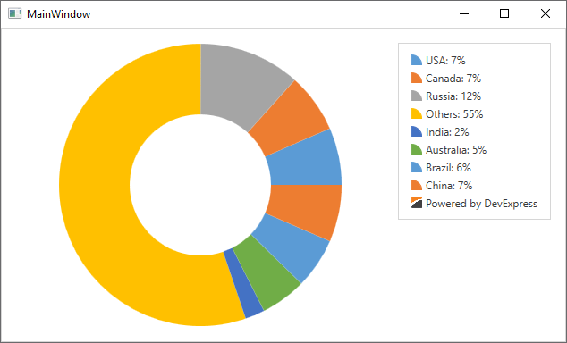

<!-- default badges list -->

<!-- default badges end -->
# How to: Add a Custom Legend Item to a Legend

This example demonstrates how to add a custom legend item to a legend.

To do this, create a new instance of the [CustomLegendItem](https://docs.devexpress.com/WPF/DevExpress.Xpf.Charts.CustomLegendItem) class and add it to the [Legend.CustomItems](https://docs.devexpress.com/WPF/DevExpress.Xpf.Charts.Legend.CustomItems) collection. Then configure the custom item. For example, you can use the [Text](https://docs.devexpress.com/WPF/DevExpress.Xpf.Charts.CustomLegendItem.Text) property to set the item's text and the [MarkerTemplate](https://docs.devexpress.com/WPF/DevExpress.Xpf.Charts.CustomLegendItem.MarkerTemplate) property to set the item's marker.

<!-- default file list -->
## Files to Look At

* [MainWindow.xaml](./CS/CustomLegendItemSample/MainWindow.xaml) (VB: [MainWindow.xaml](./VB/CustomLegendItemSample/MainWindow.xaml))
<!-- default file list end -->

## Documentation 

- [CustomLegendItem](https://docs.devexpress.com/WPF/DevExpress.Xpf.Charts.CustomLegendItem)
